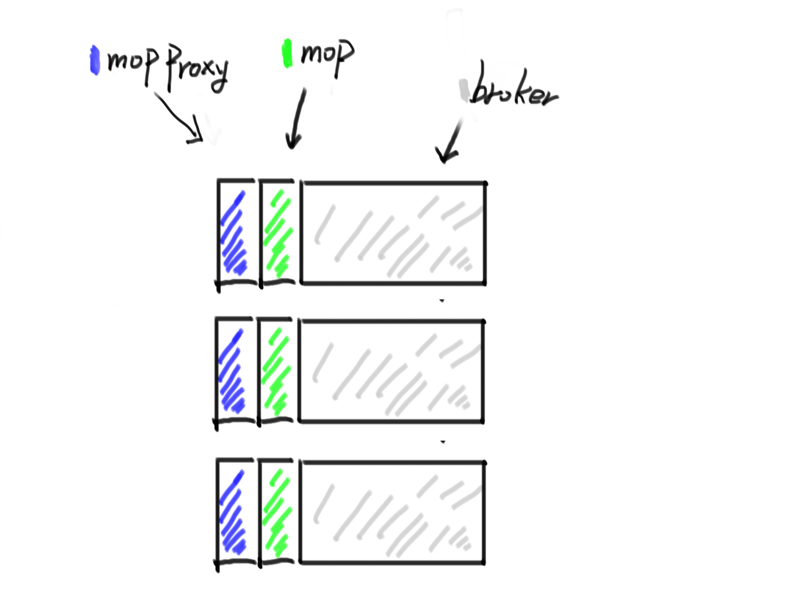
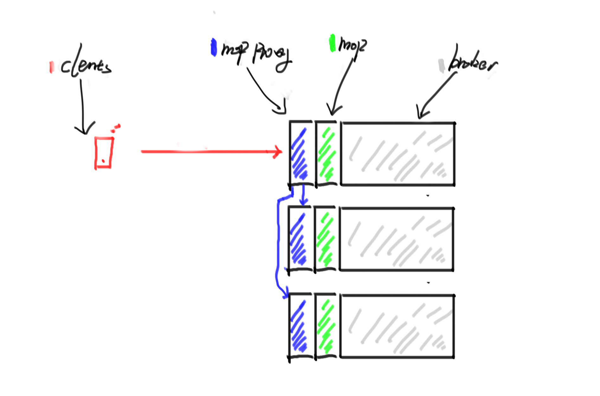
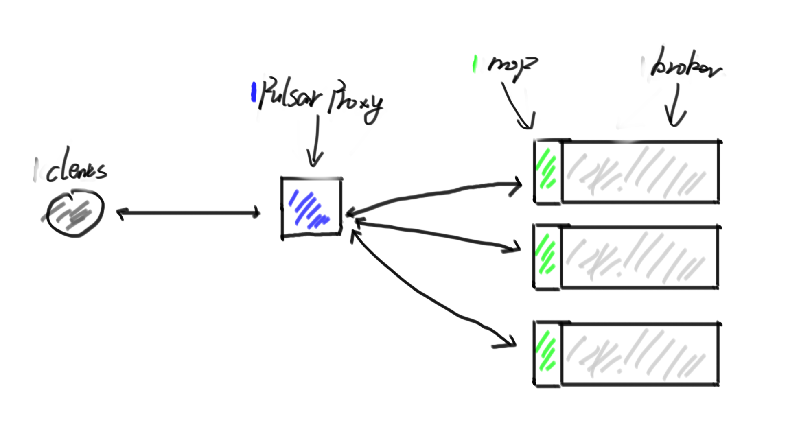

# Migrate MoP proxy to pulsar-proxy

## Motivation

Apache pulsar needs to use the lookup mechanism to find which broker the topic is on, but the MQTT protocol specification does not support any redirect mechanism yet. So we introduce the MoP proxy to do lookup at the broker. 

However, in the production environment, this design is not a good idea. for example, if we have 100k connections and want to connect to Apache Pulsar by MoP. the user probably chose one proxy address to do it. In this condition, the broker will have too much load pressure and it will affect the broker's stability.

Therefore, I suggest we use `pulsar-proxy` protocol handler mechanism to support MoP lookup operation. We will get the following advantages:

- **Decoupling**: Moving the MoP proxy out of the broker will help with decoupling.
- **No-side effect:** Will not cause the entire broker to be unstable due to excessive MoP proxy pressure.
- **Horizontal scale:** When the connection pressure is too high, we can easily extend the proxy to expand the capacity.

## Design

Because most of the logic has not changed significantly, we will try to migrate the previous logic.

### Project structure

Since we have to implement a new protocol handler for pulsar-proxy, we need to change the project structure to extract some same logic.

**MoP-common:**  This module include MQTT protocol entities and some utils.

**MoP-Broker:** Support MQTT Protocol handler for pulsar (standalone)

**MoP-Proxy:** Support MQTT protocol handler for proxy, which supports lookup mechanism, also can support cluster model with **mop-broker**

### Authentication & Authorization

We can rely on pulsar-proxy authentication & authorization mechanism. also, we can support mop self-configuration in the future if needed.

### Lookup mechanism

We have two mechanisms to support the lookup mechanism, one is to use pulsar-client to connect to the broker and then request the lookup. another way is can expand the MQTT protocol to support lookup behaviour(self-define).

I prefer to use pulsar-client first. because it’s simple enough and stable. maybe we can try the second method in the future because it will decouple to pulsar protocol.

### Socket reuse

Since the MQTT protocol is designed to support large numbers of connections, the proxy socket number is a bottleneck for us. we can support socket reuse to improve it.

However, the MQTT protocol is not supported re-use sockets (don’t have an identifier), So we have to expand the existing protocol to support it.

### Enhancement MQTT protocol between proxy and broker

In the current implementation we define simple protocol to support it, for compatibility I want to reuse this logic until we need more protocol features and we can switch to using `protobuf`.

### Configuration

We will introduce some new configurations.

- `mqttServicePort`
- `mqttServicePortTls`
- `brokerMqttServiceURL`
- `brokerMqttServiceURLTLS`

## Metrics

- active_connections: active connections number.
- connection_stats
    - request_rate:
    - byte_rate
    - client_address
    - broker_address